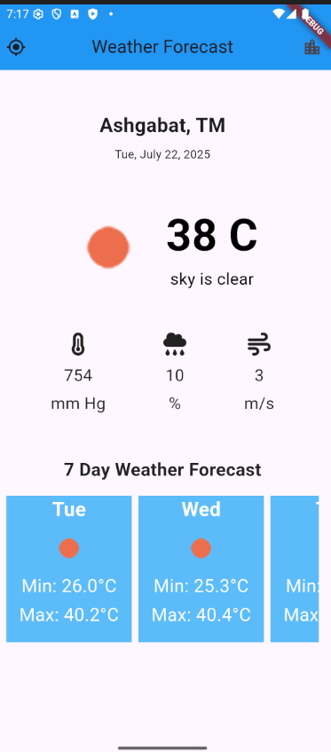
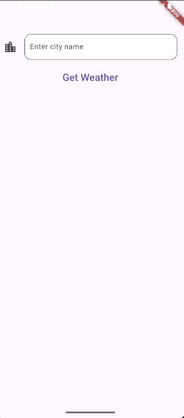

# ☀️ Weather App

This application fetches weather data using the http package and processes it in JSON format. The data is retrieved from a weather API based on the user's current location or a city name provided by the user.

---

## Features

- Get weather forecast based on your current location
- Data is receiving from openweathermap.org in JSON format 
- Display of temperature, humidity, wind speed and more
- Clean and modern UI
- Loading animations with `flutter_spinkit`

---

## 📸 Screenshots

> Add the following images to your project root or `assets/images/` folder, then use:

```md


